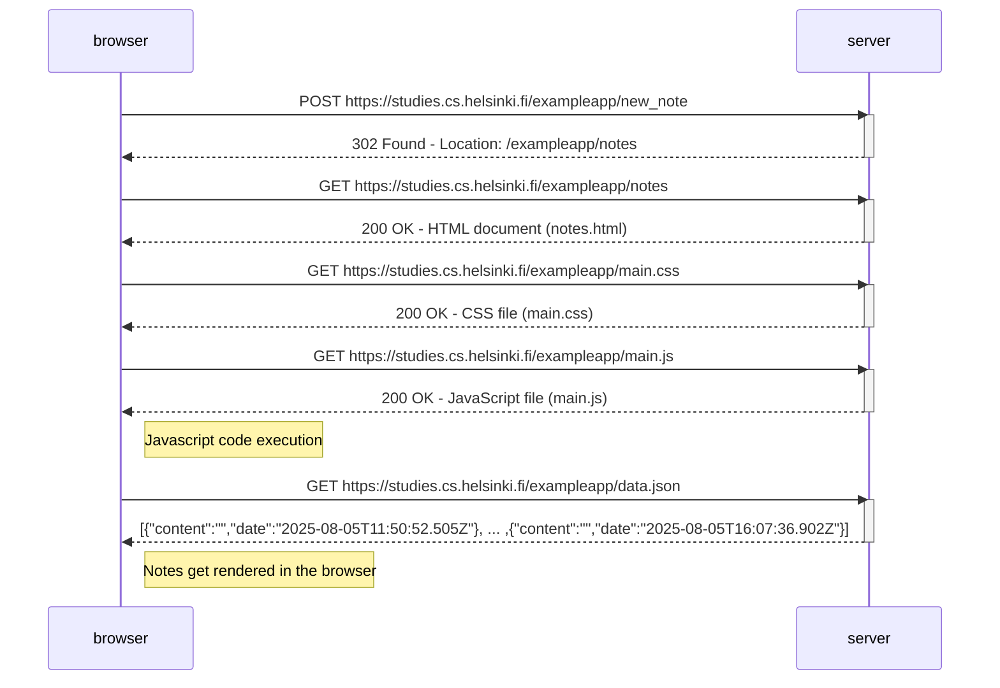

```mermaid
sequenceDiagram
    participant browser
    participant server

    browser->>server: POST https://studies.cs.helsinki.fi/exampleapp/new_note
    activate server
    server-->>browser: 302 Found - Location: /exampleapp/notes
    deactivate server

    browser->>server: GET https://studies.cs.helsinki.fi/exampleapp/notes
    activate server
    server-->>browser: 200 OK - HTML document (notes.html)
    deactivate server

    browser->>server: GET https://studies.cs.helsinki.fi/exampleapp/main.css
    activate server
    server-->>browser: 200 OK - CSS file (main.css)
    deactivate server

    browser->>server: GET https://studies.cs.helsinki.fi/exampleapp/main.js
    activate server
    server-->>browser: 200 OK - JavaScript file (main.js)
    deactivate server

    Note right of browser: Javascript code execution

    browser->>server: GET https://studies.cs.helsinki.fi/exampleapp/data.json
    activate server
    server-->>browser: [{"content":"","date":"2025-08-05T11:50:52.505Z"}, ... ,{"content":"","date":"2025-08-05T16:07:36.902Z"}]
    deactivate server

    Note right of browser: Notes get rendered in the browser
```

