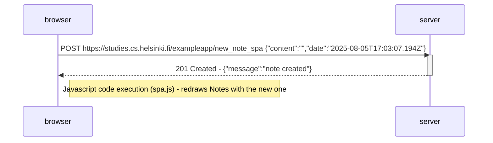

```mermaid
sequenceDiagram
    participant browser
    participant server

    browser->>server: POST https://studies.cs.helsinki.fi/exampleapp/new_note_spa {"content":"","date":"2025-08-05T17:03:07.194Z"}

    activate server
    server-->>browser: 201 Created - {"message":"note created"}
    deactivate server

    Note right of browser: Javascript code execution (spa.js) - redraws Notes with the new one 
```

